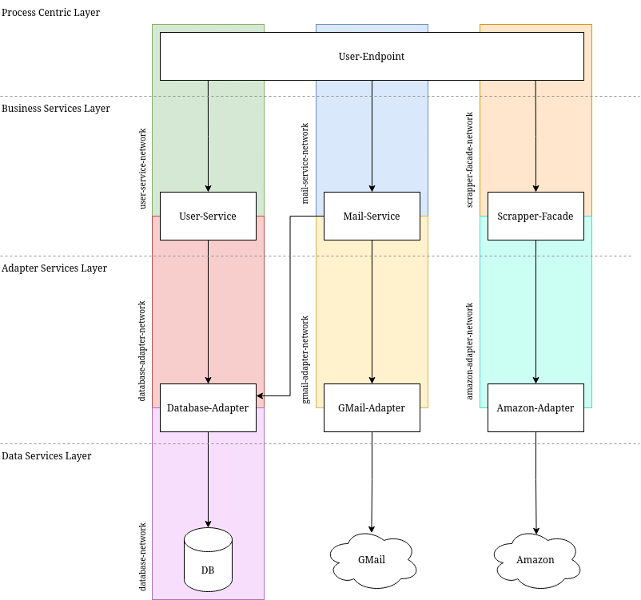
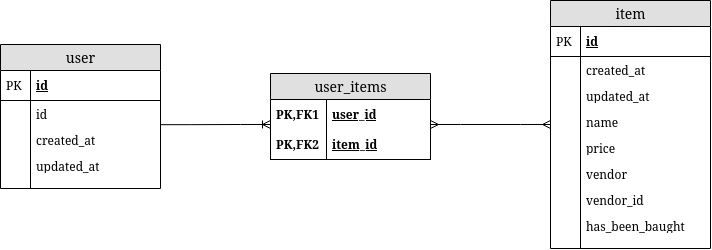

# TL;TR

The goal of this project is to present the learning of the course Service Design
and Engineering. The requirements are to develop a project that consists of 
multiple microservices and use techniques and technologies presented during the
course. The idea of the project is an application where the user can create
wishlists, and invites other persons to buy an item from that wishlist via 
email. The content of a wishlist is based on a vendor wishlist (e.g. 
Amazon.com). To make a wishlist available, the application extracts the content 
from a given wishlist URL and saves it in a structured format to the database.

# Design

This chapter describes the architecture and database design.

## Architecture



The figure illustrates the architecture of the application. It consists of four 
different layers, each serving a different purpose. Each layer (except the Data 
Layer) includes services that are designed to solve a specific task and be 
self-describing and self-continued. The architecture is designed as a 
choreography. No service takes responsibility for the whole process and services 
are aware of collaborating.

## Database



Figure 2 illustrates the UML diagram of the database model. There exist two 
models, a user, and an item. A single user owns multiple items. To simplify the 
database model, an item can only be owned by a single user. A user only exists 
of an ID that identifies a user and is unique for each one. The User-Service 
creates new user instances and randomly creates a UUIDv4 for a new user. An item 
is identified by its ID. Furthermore, the item model also saves the vendor ID 
which refers to the ID that was given by the vendor. Important to mention is 
also the has been bought property, the reason why an item can only be owned by a
single user. It represents if an item has been bought by a buyer or not.

# Documentation

-   User-Endpoint
    -   [API](https://mstolin.github.io/wishlist-inviter/user-endpoint.html)
    -   [Usage](./user-endpoint/Readme.md)
-   User-Service
    -   [API](https://mstolin.github.io/wishlist-inviter/user-service.html)
    -   [Usage](./user-service/Readme.md)
-   Mail-Service
    -   [API](https://mstolin.github.io/wishlist-inviter/mail-service.html)
    -   [Usage](./mail-service/Readme.md)
-   Scrapper-Facade
    -   [API](https://mstolin.github.io/wishlist-inviter/scrapper-facade.html)
    -   [Usage](./scrapper-facade/Readme.md)
-   Database-Adapter
    -   [API](https://mstolin.github.io/wishlist-inviter/database-adapter.html)
    -   [Usage](./database-adapter/Readme.md)
-   GMail-Adapter
    -   [API](https://mstolin.github.io/wishlist-inviter/gmail-adapter.html)
    -   [Usage](./gmail-adapter/Readme.md)
-   Amazon-Adapter
    -   [API](https://mstolin.github.io/wishlist-inviter/amazon-adapter.html)
    -   [Usage](./amazon-adapter/Readme.md)

## Generate HTML decoumentation

You will find a script called `genHtml.sh` in `docs/`. This will transform all `.apib` files
in the folder into `.html` files using _[Aglio](https://github.com/danielgtaylor/aglio)_.

```sh
$ cd docs/
$ ./genHtml.sh
```

# Usage

## Set up

### Go workspace

To simplify working with this multi-module application, Go 
[workspaces](https://go.dev/blog/get-familiar-with-workspaces) come in handy. It
can be initialized using the following command:

```sh
$ go work use utils \
    user-endpoint \
    user-service \
    mail-service \
    scrapper-facade \
    database-adapter \
    gmail-adapter
```

### Add wishlists

The [Amazon-Clone](./amazon-clone/) requires some wishlists exported from
Amazon.com. You can open a wishlist on Amazon and save it using your browser.
Then, save the content to `amazon-clone/nginx/hz/wishlist/ls/WISHLIST-ID`.

The ID is visible via the URL. For example, if your wishlist URL is
`https://www.amazon.com/hz/wishlist/ls/194N1KF03IPTL/`, the ID is 
`194N1KF03IPTL`.

### JWT

For authentication purposes, a JWT token is necessary. You can create a random
secret at https://bitwarden.com/password-generator/.

Save the secret at `/env/JWT.env`.

```sh
JWT_SIGN_KEY=THIS-IS-THE-RANDOM-SECRET
```

### Google-Mail

To send mails via the Google-Mail SMTP server an app password is necessary. This 
is explained at https://support.google.com/mail/answer/185833?hl=en. Save your 
GMail address and the app password at `/env/gmail-adapter/.env`.

```sh
GMAIL_MAIL=yourgmail@gmail.com
GMAIL_PASSWORD=THE-APP-PASSWORD
```

## Run

This project uses [Podman](https://podman.io/) to run all services in a 
container. A `docker-compose.yml` file exists in the root directory of the 
project, that can be used with 
[podman-compose](https://github.com/containers/podman-compose) to start the 
whole multi-service application. After that, the _User-Endpoint_ is available at 
[http://localhost:8080](http://localhost:8080).

```sh
$ sudo podman-compose up --build
```

After that, you can delete all _builder_ images using:

```sh
$ sudo podman image prune --filter label=stage=builder
```

You can also use podman-compose to build and run a specific collection of 
services.

```sh
$ sudo podman-compose up --build database-adapter database
```

**Important to mention**: By default only the _User-Endpoint_ and _Amazon-Clone_
are accessible through the outside. If you wanto to test/access specific 
services using Podman, you have to publish its ports in the 
`docker-compose.yml`.

## Testing

To test this project, a [Postman](https://www.postman.com/) collection is 
provided at `/Wishlist-Inviter.postman_collection.json`.

# License

[Creative Commons Attribution 4.0 International Public License](./LICENSE)
