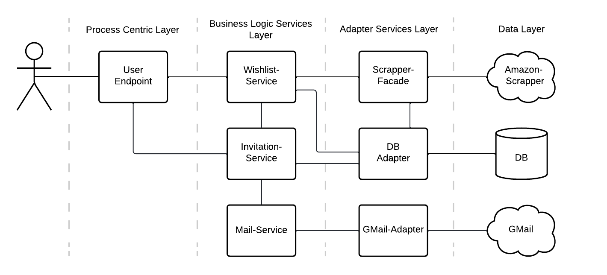

# Architecture

- User can create a wishlist from an Amazon wishlist
	- Wishlist-Service forwards the wishlist URL to the Scrapper-Facade
	- Scrapper Facade forwards wishlist URL to the corresponding scrapper
	- Wishlist-Service creates a sends the scrapper result to the DB-Adapter
	- DB-Adapter will create a new wishlist entry in the Database
- User can invite buyers to his wishlist
	- Invitation-Service will send an E-Mail to the buyer
	- Invitation-Service sends request to DB-Adapter to add buyer to a product of the wishlist
