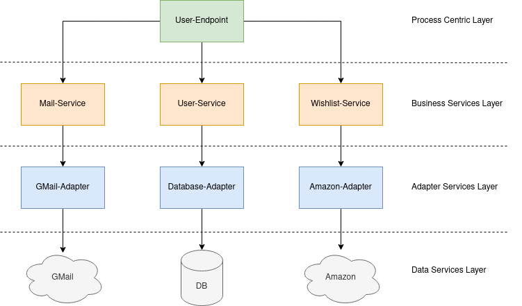

# Present-Roulette Documentation

## Overall

What is this about

## Architecture

The architecture of this project is separated in 4
different layers.

First, the Process Centric Layer consists of only 
one service, the *User-Endpoint*.

The Business Services Layer includes the 
*Mail-service*, *User-Service*, and 
*Wishlist-Service*.

Next, the Adapter Services Layer contains all
adapter and facade services, including 
*GMail-Adapter*, *Database-Adapter*, and 
*Scrapper-Facade*.

Lastly, the Data Services Layer includes all external
resources THIS IS WRONG.

## Services

- [User-Endpoint](./user-endpoint.md)
- [User-Service](./user-service.md)
- [Wishlist-Service](./wishlist-service.md)
- [Mail-Service](./mail-service.md)
- [Scrapper-Facade](./scrapper-facade.md)
- [GMail-Adapter](./gmail-adapter.md)
- [Database-Adapter](./database-adapter.md)
- [Amazon-Adapter](./amazon-adapter.md)

# Other

- [Database](./database.md)
- [Amazon-Clone](./amazon-clone.md)

